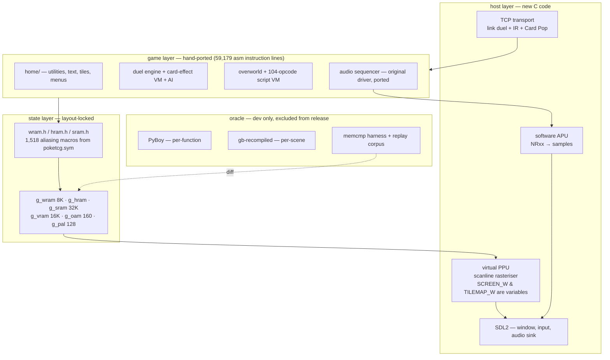

# poketcg-pc — native port plan

## Status

- **Phase 0 — Substrate** (#1): closed.
- **Phase 1 — Delete the hardware** (#2): transform recorded in
  `docs/phase1-transform.md`; applied per-slice as each routine ports.
- **Phase 2 — Leaves and save** (#3): closed.
- **Phase 3 — Timer, APU, audio** (#4): open.
- **Phase 4 — Text, tiles, menus** (#5, #18): open.
- **Phase 5 — Duel engine** (#6): open.
- **Phase 6 — Overworld and scripts** (#7): open.
- **Phase 7 — Link, IR, printer** (#8): open.
- **Phase 8 — Widescreen and features** (#9): open.

- **Current gate: 480 routines**, `just oracle-diff-all` exit 0 (home bank,
  gfx loaders/fades, Wave 3, Phase 3 audio, and Duel Core partial). Plan:
  `docs/plan.md`.

A native PC/Linux port of Pokémon Trading Card Game (Game Boy Color), hand-ported
from the [`pret/poketcg`](https://github.com/pret/poketcg) disassembly into C11
(`static_assert` locks the generated WRAM/HRAM/SRAM layout headers against the
disassembly) + SDL2. No emulator bundled, no ROM required at runtime. Widescreen and other
quality-of-life features land later, strictly on top of verified code.

This document is the synthesis of ten parallel investigations: four on prior art
(`zelda3`, `suiCune`, `Gen1Recomp`, `Links-Awakening-DX-HD`, `CppRed`) and six
mapping this codebase (graphics, duel engine, overworld/scripts, audio/save/link,
timing dependencies, build/data pipeline).

## TL;DR — the decision

Hand-port every function to C, keeping a **software PPU whose screen and tilemap
dimensions are runtime variables**. Preserve the original memory layout
byte-for-byte so a whole-state `memcmp` against the ROM is a valid correctness
oracle. Add widescreen **only** as a layer on top of already-verified 4:3 code.

This is `zelda3`'s architecture (virtual PPU + RAM oracle + span-widened
widescreen) with `suiCune`'s conversion discipline (function-by-function hand
port, verified against the original) and `Gen1Recomp`'s variable logical canvas
(widen the surface, re-lay-out one screen, leave the simulation untouched). Each
choice is load-bearing and each has a shipped precedent.

The decisive constraint, verified directly from the built ROM's symbol table:

| region | size | notes |
|---|---|---|
| WRAM | 7,909 B | **flat** — all 8 rgbds sections are `WRAM0`, zero `WRAMX` |
| HRAM | 128 B | 44 named symbols |
| SRAM | 4 banks × 8 KiB | 272 symbols; bank 0 mirrors into bank 2 as backup |
| VRAM | 16 KiB | 2 banks |
| OAM | 160 B | |
| palettes | 128 B | |

The entire mutable state of the game is ~56 KiB. `zelda3` `memcmp`s 128 KiB of
SNES WRAM + 64 KiB VRAM every frame and still runs at turbo speed. Full-state
diffing here is free. That single fact turns this from "a multi-year rewrite you
hope is correct" into "a multi-month rewrite that is provably correct at every
step."

## Architecture



Three rules make it work:

**(a) Game code never sees a host type.** It writes `g_vram`, `g_oam`, `g_wram`
exactly where the asm wrote `$9800`, `$ca00`, `$c200`. The `wram.h` header is
generated mechanically from `poketcg.sym` (`make DEBUG=1` emits all 20,280
symbols; 1,518 are WRAM, at known flat offsets):

```c
#define wRNG1                  (*(uint8_t *)(g_wram + 0x0aca))
#define wPlayerDuelVariables   ((uint8_t *)(g_wram + 0x2200))
#define wOAM                   ((OamEnt   *)(g_wram + 0x0a00))
```

`suiCune` proves the layout with
`static_assert(offsetof(struct wram_s, f) == f - WRAM_0_ADDR)`; do the same for
every struct you promote from raw bytes.

**(b) The PPU is the only thing that knows about pixels**, and it is a normal,
editable C module — not an emulator you vendored. That is what makes both
widescreen and the oracle possible simultaneously. `zelda3` gets 4× Mode-7
upsampling, 240-line mode, and widescreen from this one property.

**(c) Dimensions are variables from commit one.** `BCCoordToBGMap0Address`
(`src/home/empty_screen.asm:26-38`) computes the tilemap stride as five chained
`add hl,hl` — the ×32 is an *instruction pattern*, not a constant. Only 15 sites
use the symbolic `TILEMAP_WIDTH`. Every one hand-translates to
`&bgmap[y * TILEMAP_W + x]`. Widescreen is nearly free if you do this on the way
in, and a second full pass if you don't. Non-negotiable.

## Why not the alternatives

| Rejected | Reason |
|---|---|
| Vendor `suiCune`'s substrate | It compiles Peanut-GB into the binary and keeps `gb.cpu_reg.pc` live forever. `constants/gfx_constants.h` hardcodes `SCREEN_WIDTH 20`, `BG_MAP_WIDTH 32`; output is locked to a 160×144 RGB555 texture with `SDL_RenderSetLogicalSize`. Every ported function then does tilemap math against a 32-tile stride permanently. Excellent method, wrong substrate. |
| Native renderer, drop tilemaps | Forecloses the `memcmp` oracle — and the oracle is the entire reason this is finishable. Also breaks the printer, which composes 160-px bands through the tile pipeline (`src/engine/link/printer.asm:419`). |
| Any asm→C transpiler | `CharlesAverill/poketcg` is the worked counterexample: one commit, `lift_skeleton.py` maps `jr`/`jp` to *comments*, 75% of its 212k lines are commented-out asm, `src/home/hblank.c` has an empty body, and it does not compile (`registers.h:15: 'CPURegs' has no member named 'regs'`). Do not join, do not salvage. More fundamentally: `farcall`/`bank1call` rewrite return addresses on the stack (`src/home/farcall.asm:3-79`) and 149 event macros read their operand *from the return address*. No line-by-line lifter survives that. A human deletes it in a second. |
| Bundle the ROM or extracted assets | Links Awakening DX HD shipped assets and was DMCA'd within a day of publicity — the widescreen and 120fps did not save it. Its *source* fork is still up. |

## Widescreen, concretely

Four mechanisms, all with working source precedents.

**Span widening (from `zelda3`).** Size every scanline buffer
`160 + 2*kExtraLeftRight` at build time, bias all writes by that constant so
x=0 lands at the offset and negative x is legal, then move the draw span:

```c
/* zelda3 snes/ppu.c:204-208, adapted */
win->edges[0] = -(layer != HUD_LAYER ? ppu->extraLeftCur : 0);
win->edges[1] = SCREEN_W + (layer != HUD_LAYER ? ppu->extraRightCur : 0);
```

The existing, unmodified per-layer rasterisers then emit wider lines. Zero
duplicated renderers. `layer != HUD_LAYER` is the entire HUD fix at PPU level.

**Variable logical canvas (from `Gen1Recomp`).** Its `setUISize` lets a game
state request a wider surface — the widescreen battle asks for 304×144 and
re-lays-out the menu as 2×2 while *"the battle simulation, timing, animations
and rules stay BattleState's"*. poketcg is menus plus one duel screen — this is
exactly the shape of the problem. Widen the canvas, re-author the duel/menu
screen builders, leave the 826-byte duel state untouched.

**Single viewport rect (from LADX-HD).** For the overworld only, derive the
render rect from the live window and feed *the same rect* to culling, NPC
updates, and animation (`GameManager.cs:602-605` → `ObjectManager.cs:192-198`,
`// only update the objects that are in a tile that is visible`). One definition
of "active region" means rendering and simulation cannot desync. Keep room
semantics as a logical grid decoupled from the viewport
(`FieldWidth`/`FieldHeight` + per-field update counters) — how LADX-HD preserved
GB room-reset behaviour under a 5-room-wide camera.

**The honest problem, and its answer.** The GB tilemap is 32×32 and wraps;
poketcg is screen-composed, so there is usually no valid off-screen tile data to
reveal. `zelda3` clamps the extension to the current room bounds every frame
(`ConfigurePpuSideSpace`, `src/zelda_rtl.c:140-173`) so the view narrows back to
4:3 rather than showing junk, and disables widescreen for the one effect it
cannot widen (dungeon lantern cone). For poketcg the extra columns must mostly
be **authored** — a background fill or explicitly uploaded tiles — in the screen
builders. Budget widescreen as work in `engine/menus/` and the duel screen, not
in the PPU.

**Sprite limits are orthogonal.** GB's 10-per-scanline / 40-OAM limits live only
in sprite evaluation, which reads OAM and writes the object buffer — never back
into OAM or WRAM. So a `NoSpriteLimits` render flag changes pixels only and
stays out of the `memcmp` entirely (`zelda3 snes/ppu.c:1247`). The game's own
allocator is a 40-entry bump list with a carry-on-overflow contract
(`src/home/objects.asm:14-19`) plus 16 animated slots
(`SPRITE_ANIM_BUFFER_CAPACITY EQU 16`); widening is an array size.

**Raster effects: per-scanline offset arrays, not STAT interrupts.** `CppRed` has
the right abstraction — `Point bg_offsets[144]; Point window_offsets[144];` with
a range setter. poketcg's LYC handler (`src/home.asm:34-36` calls
`wLCDCFunctionTrampoline`) and `src/home/scroll.asm` write ranges into those
arrays; the renderer consumes them per line. `suiCune`'s
`wLYOverrides[LY] + hLCDCPointer` (`home/lcd.c:20-24`) is the same idea limited
to one register — take the array version.

## Verification harness

This is what decides whether the project ships, and it is what `suiCune` did
*not* have (manual playtesting; 4.4 years, 70% done).

**Snapshot vector — everything**, since it is only 56 KiB: WRAM + HRAM + SRAM +
VRAM (2 banks) + OAM + palette RAM + the CPU register file. `smw`'s wider vector
(adds OAM and CGRAM over `zelda3`'s) is the right model.

**Two oracles, two granularities.**

- **Per-function — PyBoy.** `hook_register(None, "Label", ...)` resolves
  breakpoints against `poketcg.sym` directly, with full read/write on registers,
  all WRAM, both VRAM banks, OAM, and cart RAM. Synthesise an input state, run
  one ROM routine to its `RET`, capture the output state. This is `zelda3`'s
  `RunEmulatedFunc(pc, a, x, y, ...)` tier, and it is the daily loop — port a
  function, diff it, move on.
- **Per-scene — gb-recompiled.** Deterministic headless replay (`--input`,
  `--limit-frames`), savestates carrying full memory, and `--trace-entries`
  emitting `bank:addr` in the exact `BB:AAAA` convention of rgblink's `.sym` — so
  joining a trace against the symbol table tells you which routines a scene
  actually exercises, letting you order work by real coverage instead of guessing.

gb-recompiled's cheap JSON `--dump-state` covers `wram_bank_0_c000_cfff` +
`wram_bank_1_d000_dfff` — which, because poketcg's WRAM is flat and unbanked, is
**100% of the game's WRAM**. Lucky fit. VRAM/OAM/SRAM come from
`--save-state-file`, whose header is self-describing (`'GBSV'` magic, explicit
per-region sizes) and parseable without patching anything.

**Three traps hit while measuring, documented so you don't repeat them:**

1. A stale `.sav` in `--save-dir` silently changes the route — the game takes
   *Continue* instead of *New Game*. Wipe the save dir before every run.
2. Frame numbering is **not** comparable across oracles. gb-recompiled starts
   from a configured post-boot state (no CGB boot ROM; `GBC.md` discloses the
   `boot_div-cgb*` failures); PyBoy runs its own bundled `bootrom_cgb.bin` and
   overlays a splash. Anchor on game events, never frame indices.
3. Screen comparison is exactly solvable. Both derive from the same CGB 5-bit
   values and differ only in expansion — gb-recompiled does `c*255/31` truncated
   (`runtime/src/ppu.c:138-143`), PyBoy does `c<<3`. Invert both to the 5-bit
   domain and comparison is bit-exact. Also: `--dump-frames` silently truncates
   to 100 indices per run (`MAX_DUMP_FRAMES`), and `--input` caps at 2048 entries
   — use the periodic `p<start>-<last>/<period>` form for long routes.

**Structure it as `smw` does, not `zelda3`.** A per-game vtable — `run_frame`,
`run_frame_emulated`, `fix_snapshot_for_compare`, `patch_bugs` — plus a tri-state
`RM_BOTH / RM_MINE / RM_THEIRS`. And steal `smw`'s best idea: on mismatch, write
`saves/bug-<timestamp>.sav` and show an on-screen countdown. **Ship the oracle to
testers as a crowd-sourced bug reporter.**

**Budget an exclusion list.** `zelda3`'s is ~25 lines, each with a one-line
justification, in three categories: emulator-authoritative (scratch,
uninitialised temporaries, the SM83 stack region — your C has no GB stack),
C-authoritative, and port-only state. For poketcg, day-one exclusions are
`rSTAT`/`rLY`, DIV/TIMA, and anything the audio path touches.

**Regression corpus.** Base snapshot + RLE'd input log + interleaved patch-byte
commands. `zelda3` got full-game regression from 13 chapter saves and no test
framework. Here the analogue is **seeded duel replays** — and they will be
bit-exact, because:

> `UpdateRNGSources` (`src/home/random.asm`) is a pure software LFSR over
> `wRNG1`/`wRNG2`/`wRNGCounter`. **Zero hardware entropy — 0 reads of `rDIV`
> anywhere in the codebase.** Duel outcomes are fully determined by inputs.

That is the single most favourable fact about this game for porting.

**Gate the oracle off when features are on.** `zelda3 src/zelda_rtl.c:742`:
`if (enhanced_features0 != 0) ZeldaRunFrameInternal(...)` — *"can't compare
against real impl when running with extra features"*. Verify at 160×144 with zero
features; widescreen strictly on top of verified code.

## Phases

Ordered by dependency and by how cheaply each slice can be oracle-diffed. Line
counts are measured.

| Phase | Scope | Lines | Weeks | Gate |
|---|---|---|---|---|
| 0 — Substrate | memory arrays; `wram.h`/`hram.h`/`sram.h` from `.sym`; virtual PPU (variable dims + per-scanline offsets); SDL2 shell; PyBoy + gb-recompiled harnesses; snapshot/compare/replay | — | 2–3 | a trivial leaf (e.g. `ClearSRAMBGMaps`) diffs clean; a recorded replay round-trips |
| 1 — Delete the hardware | mechanical removal of banking, HBlank gating, interrupts, DMA, speed switching (see table below) | — | 1 | clean compile; same leaf still diffs |
| 2 — Leaves and save | `home/` pure utilities; SRAM + save + validation | 673 + 1,157 | 2–3 | a C-written save loads in an emulator and vice versa |
| 3 — Timer, APU, audio | tick the original driver against a software APU | 4,812 code + 26,252 data | 4–6 | `(tick, register, value)` write trace matches |
| 4 — Text, tiles, menus | text engine, tilemap/BG-map, menu framework | 1,740 + 1,160 + 14,813 | 8–10 | screens render byte-identically |
| 5 — Duel engine | state, turn loop, card-effect VM, AI, RNG | 44,614 | 12–16 | replay a seeded duel, `memcmp` the 826-byte state every turn |
| 6 — Overworld and scripts | 104-opcode VM, maps, NPCs | 12,129 | 6–8 | walk every map; scripts fire correctly |
| 7 — Link, IR, printer | TCP transport; Card Pop / Gift Center; printer→PNG | 3,468 | 4–5 | a link duel round-trips; a card exports to PNG |
| 8 — Widescreen and features | span widening, variable canvas, viewport rect, QoL | — | 6–8 | replay corpus still passes at 4:3; widescreen is additive |

**Total: 12–18 months solo; 6–9 months with 2–3 developers** (Phase 5 splits
cleanly). Calibration: `suiCune` reached 70% of pokecrystal in 4.4 years solo
*without* an oracle, on a codebase twice this size (8.56 MB vs 4.26 MB of asm);
`zelda3` is ~70–80 kLOC of C *with* an oracle.

### Phase 1 — the hardware-removal transform

Highest leverage; must come first.

| Construct | sites | resolution |
|---|---|---|
| `farcall` / `bank1call` + `rst $18`/`$28` trampolines | 994 | plain C call. Delete `Bank1Call`, `FarCall`, `SwitchToBankAtSP`, `BankpushROM`, `BankpopROM`, `hBankROM` |
| `SafeCopyDataHLtoDE` HBlank gate | all tilemap writes | unconditional `memcpy` — proven safe, it writes identical bytes on both branches (`src/home/bg_map.asm:100-115`) |
| `HblankCopyDataHLtoDE` busy-wait | `src/home/hblank.asm` | delete; a software PPU has no VRAM access window |
| `halt` / `WaitForVBlank` | 3 `halt` | `DoFrame()` becomes the frame boundary |
| `stop` + KEY1 double-speed | 1 | delete; `SetupTimer` already rate-compensates |
| inline-operand event macros | 149 | `SetEventValue(EVENT_FOO, c)` |
| `jp hl` / jump tables | 17 / 33 | C function-pointer tables — remarkably small and fully enumerable |
| OAM DMA (`hDMAFunction` copied into HRAM) | 1 | `memcpy(g_oam, wOAM, 160)` |
| SGB path | 24 branch sites | drop, or keep behind a flag |
| HDMA / GDMA | 0 | nothing to do |

### Phase 5 — the duel engine is tractable

The entire duel state is **826 bytes**, and the game itself enumerates it —
`DuelDataToSave` (`src/engine/duel/core.asm:6117-6126`, in-tree comment
`; 826 bytes`, matching `SAVE_DUEL_DATA_SIZE`). Seven regions: two 256-byte
page-aligned per-duelist blocks, 272 bytes of decks + name, 22 bytes of duel
state, `hWhoseTurn`, 3 bytes of RNG, 16 bytes of AI vars. Anything it omits is
derived or presentation. **That is the C struct, exactly.**

Two structural notes: the per-duelist blocks are `$100`-aligned by assertion
because `PLAYER_TURN`/`OPPONENT_TURN` *are* the page bytes — all access is
`ld l,offset / ld h,hWhoseTurn`, so the duelist selector is the high byte. And
the card-effect layer is a command VM whose opcode tables come from
`src/macros/`; port it as a VM, not as unrolled logic.

### Phase 6 — scripts are hybrid

One trap: scripts interleave native asm and bytecode inside a single function.
`start_script` is `rst $20`; the handler pops its own return address as the
bytecode pointer, interprets until `wBreakScriptLoop`, then `retbc`
(`push bc; ret`) resumes native asm at the byte after the last command — see
`src/scripts/mason_laboratory.asm:57-77`. **You cannot split "VM" from "game
code" along file boundaries.** Each script file becomes a C function mixing
statements with `RunScript(&blob)` calls.

Also: bank co-residency is load-bearing. `Func_c943` and `HandleMoveModeAPress`
hardcode `BANK(MapScripts)` while dereferencing into `npc_map_data.asm` /
`map_objects.asm`, which only works because both sections land in ROMX `$04`.
Deleting banking (Phase 1) resolves it — just don't preserve it by accident.

### Phase 7 — link, IR, printer

One TCP transport with a session-type byte serves both link duels and IR. IR's
physical layer is cycle-counted bit-banging (a bit is pulse-present-vs-absent in
a fixed slot, the two code paths deliberately length-matched, `di` held for the
whole session) — it has no portable meaning: **delete `ir_core.asm:6-240`
wholesale.** Keep only what is above it: the 8-byte register-frame ABI, the
`IRCMD_*` dispatcher, param/magic matching, the Card Pop name-list exchange and
its name-hash rarity roll, the Gift Center payloads. The `rSTAT` VBlank
rendezvous in `CloseIRCommunications` becomes a no-op.

Two security fixes while there: drop `IRCMD_CALL_FUNCTION` (`ir_core.asm:350-357`)
— it is `jp hl` to a *peer-supplied address* (remote code execution by design,
no local caller ever sends it). And bounds-check the `de`/`c` pair in
`IRCMD_RECEIVE_DATA`, an otherwise unchecked remote memory write.

Printer: cut at `SendPrinterPacket`. Keep the composition (layout, 1bpp→2bpp
expansion, 40-tile band slicing — ordinary rendering); replace the 12-step IRQ
state machine, RLE compressor and checksum with a band accumulator that writes a
PNG. Strictly less code than emulating a printer, and "printer not connected"
becomes "saved to `~/poketcg/prints/`".

## Data pipeline

**Extract from the built ROM using `poketcg.map` section extents + `poketcg.sym`**
— not from the `.asm` sources, and not by keeping rgbds in the loop. Rejected
options fail concretely:

- *Keep assembling and `INCBIN` the ROM's data sections* — leaves every
  `dw Label` as a 16-bit bank-relative GB address requiring a permanent
  bank-resolution shim.
- *Parse the `.asm` macros directly* — `textpointer`, `gfx`, and `frame_table`
  cannot be evaluated without final link addresses, and rgbds' stateful
  4-charmap text engine has no standalone equivalent.
- *Use the existing Python tools* — all eleven are dead. `wram.py` and `gfx.py`
  are Python 2 and don't parse under 3; `script_extractor*.py` and
  `extract_anim_data.py` are one-shot bootstrappers reading `baserom.gbc` at
  hardcoded offsets; `constants.py` is a stale hand-maintained duplicate. Also:
  `tools/gfx.c` and `tools/bgmap.c` never run — guarded by
  `$(if $(tools/gfx),...)` and nothing in the repo ever sets those variables.

Drive extraction from a hand-written schema (~20 entries) harvested from
`src/macros/wram.asm`'s struct macros and the existing `table_width` /
`assert_table_length` annotations. Follow `CppRed`'s two-stage codegen shape
(tables in, C arrays out).

**Assets:** convert from the built `.2bpp`/`.1bpp`/`.pal` artifacts, not the
PNGs — going back to PNG erases the whole rgbgfx flag matrix, including all 26
`-x N` trim-end overrides and the cards' `--columns --colors embedded
--auto-palette`. Keep 2bpp tile data (175 KB for cards, vs 2.8 MB as RGBA) and
decode to paletted indices at load. Decompress the ~207 `.lz` blobs at build
time but keep the ~40-line decompressor — two call sites use it as a streaming
row-at-a-time API into strided destinations. Note that byte-exactness of 128 of
those blobs depends on checked-in `.lz.match` files the greedy compressor cannot
reproduce.

**Legal posture:** commit the engine and the extractor; commit nothing generated.
`Gen1Recomp` ships a metadata-only manifest (label → `[bank, addr]`, no dialogue,
no images, no ROM bytes) and is still up; LADX-HD bundled assets and was taken
down. The in-tree PNGs make bundling tempting — that is precisely the failure
mode.

## Top risks

| # | risk | mitigation |
|---|---|---|
| 1 | Scope collapse from unbounded per-function verification | Phase 0 harness **before any game code**. This is what cost `suiCune` years. |
| 2 | Dimensions baked in during Phases 2–6, forcing a second pass | `SCREEN_W`/`TILEMAP_W` symbolic from the first commit; assert no literal 32/20/18 in tilemap math in review |
| 3 | Hybrid asm+bytecode scripts resist clean C structure | Design the `RunScript` re-entry contract in Phase 0, before touching `src/scripts/` |
| 4 | Widescreen has no valid off-screen tile data | Author the margins in the screen builders; clamp-to-bounds as fallback, `zelda3`-style |
| 5 | Audio timing at 60.235 Hz, not 60 Hz | Derive the tick from `16384/68/4` exactly; `sPlayTimeCounter` must stay cartridge-compatible |
| 6 | Bug-compatibility vs. correctness | Preserve original bugs by default behind a `faithful`/`fixed` ruleset gate. Known ones to keep: the Card Pop name-check loop that discards its result (`card_pop.asm:195-208`); `VENUSAUR_LV64` unobtainable because both hash halves share parity (`:328-337`); SFX preemption not silencing the previous SFX (`sfx.asm:485-499`). |

## Start here

1. **Build the ROM with full symbols:**
   ```sh
   cd poketcg && make DEBUG=1   # emits poketcg.sym (20,280 symbols, incl. 1,518 WRAM)
   ```
2. **Write the `.sym` → `wram.h`/`hram.h`/`sram.h` generator.** Half a day, and
   it makes the oracle possible.
3. **Stand up the PyBoy function-oracle harness:** load state → set registers →
   break at symbol → run to `RET` → dump full state. Install with
   `uv tool install pyboy` (or `uv venv && uv pip install pyboy`); it auto-loads
   `poketcg.sym`.
4. **Port `UpdateRNGSources` (`src/home/random.asm`) first** — ~20 lines, pure,
   zero dependencies, and it proves the whole loop end to end.
5. **Keep gb-recompiled as the scene oracle.** Generate a project with
   `gbrecomp poketcg.gbc --symbols poketcg.sym`; regenerate with `--native-patch`
   when you want function-level A/B on that side too.

The one thing not to compromise on: **nothing enters the game layer before the
oracle works.** Every precedent that shipped had one; the precedent that stalled
at 70% did not.

## Prior art referenced

- [`snesrev/zelda3`](https://github.com/snesrev/zelda3) — ALTTP→C, software PPU,
  `memcmp` lockstep oracle, span-widened widescreen.
- [`DanZC/suiCune`](https://github.com/DanZC/suiCune) — Pokémon Crystal→C,
  function-by-function hand port; the conversion methodology (wrong substrate
  for widescreen).
- [`bryanthaboi/gen1recomp`](https://github.com/bryanthaboi/gen1recomp) —
  Pokémon R/B/Y→Lua, variable logical canvas (`setUISize`), manifest boundary.
- [`ihm-tswow/Links-Awakening-DX-HD`](https://github.com/ihm-tswow/Links-Awakening-DX-HD)
  — LADX→C#, single-viewport-rect widescreen; DMCA'd for bundling assets.
- `CppRed` — Pokémon Red→C++, per-scanline `bg_offsets[]`/`window_offsets[]`,
  CSV→codegen data pipeline.
- [`arcanite24/gb-recompiled`](https://github.com/arcanite24/gb-recompiled) —
  the static recompiler used here only as the per-scene oracle.
